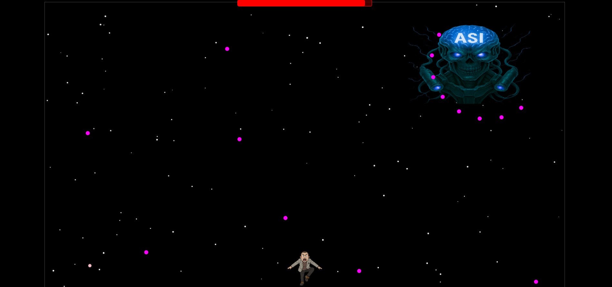

# 25aihack_Team_Taiyaki

全日本 AI ハッカソン 2025 西日本大会で作成した成果物のリポジトリです。  
ASIが実現し、ホワイトカラーの失業が続出する世界で、サラリーマンが ASI を撃破しに行く――そんな世界観で制作した 2D シューティングゲームです。

## プレイ画面

---

## 遊び方
1. 本リポジトリをクローン、または ZIP でダウンロードして解凍します。  
2. `aihack25` フォルダ内の **`ASI.html`** をブラウザで開きます。  

> **NOTE**  
> 本来はネガティブワードに応じた音声が自動生成・再生されますが、現状は音声が再生されません。  
> シューティング自体は遊べるので、ぜひクリアを目指して挑戦してみてください！

---

## 操作方法
| 操作 | キー |
| :--- | :--- |
| 移動 | 矢印キー |
| ショット | スペースキー |

---

## 使用技術

